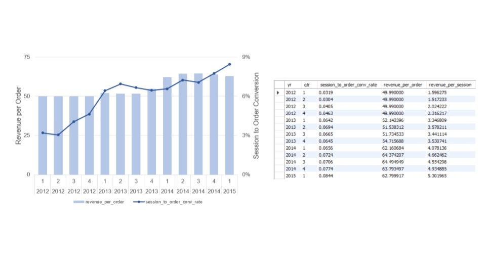
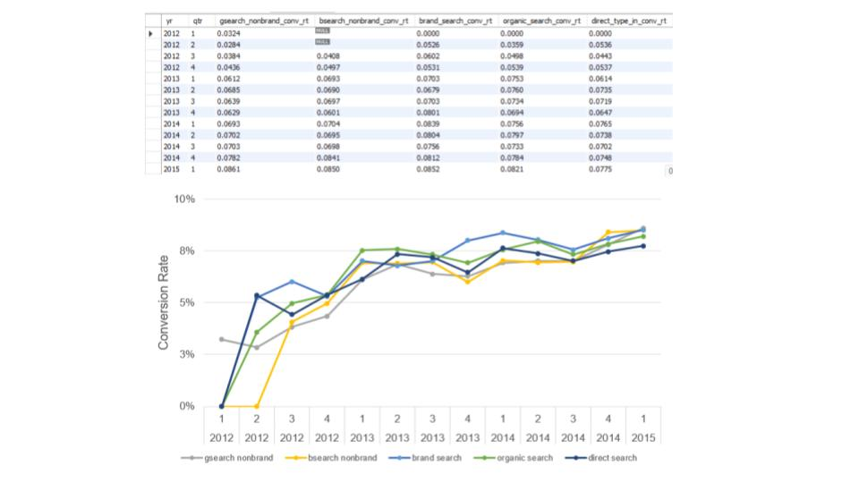
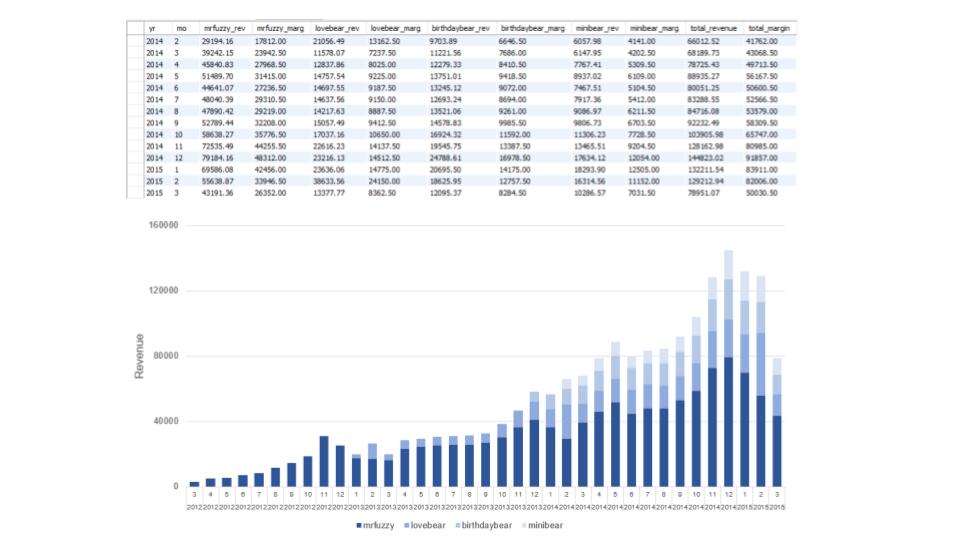
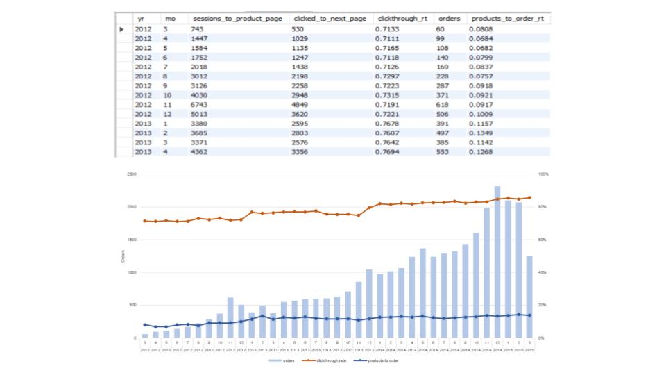
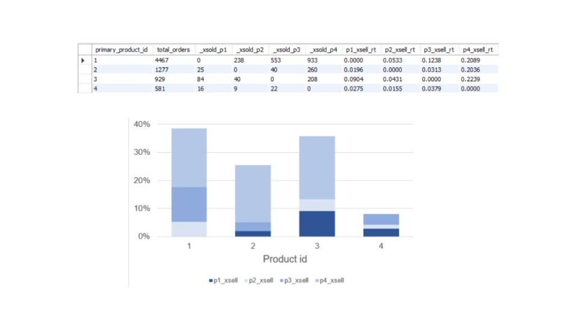

# **Ecommerce Growth Analysis**

## **The Situation**
Cindy is close to securing Maven Fuzzy Factory’s next round of funding, and she needs your
help to tell a compelling story to investors. You’ll need to pull the relevant data, and help your
CEO craft a story about a data-driven company that has been producing rapid growth.

## **The Objective**
**Use SQL to:**
Extract and analyze traffic and website performance data to craft a growth story that your
CEO can sell. Dive in to the marketing channel activities and the website improvements that
have contributed to your success to date, and use the opportunity to flex your analytical skills
for the investors while you’re at it.
As an Analyst, the first part of your job is extracting and analyzing the data. The next (equally
important) part is communicating the story effectively to your stakeholders.

## **Goals**
* Tell the story of your company’s growth, using trended performance data
* Use the database to explain how you’ve been able to produce growth, by diving in to channels and website optimizations
* Flex your analytical muscles so the VCs know your company is a serious data-driven shop

## **Analysis**
1. First, I’d like to show our volume growth. Can you pull overall session and order volume, 
trended by quarter for the life of the business? Since the most recent quarter is incomplete, 
you can decide how to handle it.

2. Next, let’s showcase all of our efficiency improvements. I would love to show quarterly figures 
since we launched, for session-to-order conversion rate, revenue per order, and revenue per session. 

3. I’d like to show how we’ve grown specific channels. Could you pull a quarterly view of orders 
from Gsearch nonbrand, Bsearch nonbrand, brand search overall, organic search, and direct type-in?

4. Next, let’s show the overall session-to-order conversion rate trends for those same channels, 
by quarter. Please also make a note of any periods where we made major improvements or optimizations.

5. We’ve come a long way since the days of selling a single product. Let’s pull monthly trending for revenue 
and margin by product, along with total sales and revenue. Note anything you notice about seasonality.

6. Let’s dive deeper into the impact of introducing new products. Please pull monthly sessions to 
the /products page, and show how the % of those sessions clicking through another page has changed 
over time, along with a view of how conversion from /products to placing an order has improved.

7. We made our 4th product available as a primary product on December 05, 2014 (it was previously only a cross-sell item). 
Could you please pull sales data since then, and show how well each product cross-sells from one another?

8. In addition to telling investors about what we’ve already achieved, let’s show them that we still have plenty 
of gas in the tank. Based on all the analysis you’ve done, could you share some recommendations and 
opportunities for us going forward? No right or wrong answer here – I’d just like to hear your perspective!

